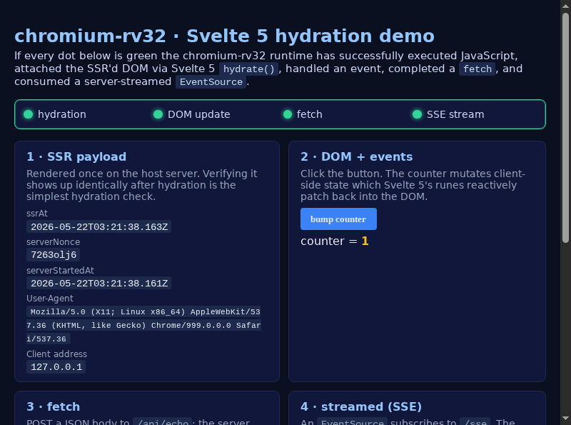

# chromium-rv32

A reproducible, source-light recipe for building **Chromium**
`content_shell` (and standalone **V8 `d8`**) for `riscv32-linux-gnu`,
running it under `qemu-system-riscv32`, and exercising a modern
**Svelte 5** application with hydration, fetch, SSE streaming, and a
real interactive GUI session.

> **Status: public alpha.** Reproducible end-to-end on Linux/WSL2 hosts.
> Suitable for kicking the tyres on RV32 Chromium; **not** production
> quality. Several known V8 correctness issues are deferred (see
> [`docs/known-limitations.md`](docs/known-limitations.md)).



> *Above: the Svelte 5 demo as rendered by `content_shell` inside the
> rv32 guest. The PNG was captured via `Page.captureScreenshot` after
> the page emitted `m6:all-green` — i.e. SSR hydration, DOM update,
> `fetch` POST, and the SSE stream had all converged.*

## What this project actually proves

When you run the documented sequence to completion, a **rv32 build of
Chromium `content_shell`** running inside a `qemu-system-riscv32`
guest:

| Capability | How it's verified |
|---|---|
| SSR + hydration | The Svelte 5 dashboard logs `m6:hydrated:<iso>` once `onMount()` fires. |
| Reactive DOM updates | `m6:dom-update:counter=<n>` after the rune-driven counter ticks. |
| `fetch` POST round-trip | `m6:fetch-ok:at=<iso>` from a JSON echo to the host server. |
| SSE / Server-Sent Events | `m6:sse-tick:n=<n>:at=<iso>` per second from the `/sse` endpoint. |
| Convergence | `m6:all-green` is logged by a Svelte `$effect` once all four lights are on. |
| Real pixels | `Page.captureScreenshot` returns a PNG showing the four dots green. |
| Mouse + keyboard input | A host-side CDP→RFB bridge streams content_shell's framebuffer to any VNC client and forwards pointer/key events back as CDP `Input.dispatch*` calls. See [`artifacts/example-m7-click-proof.png`](artifacts/example-m7-click-proof.png) for a post-click frame. |

## What this is **not**

* **Not** a full Chromium UI. Only the headless `content_shell` is
  built. No browser chrome, no bookmarks, no Chrome Sync.
* **Not** a performant runtime. V8's RV32 Maglev / Sparkplug tiers are
  off; we ride the Ignition interpreter + Turbofan (tier-up via the
  bytecode-budget interrupt path was restored in M9 — see
  [`docs/known-limitations.md`](docs/known-limitations.md)).
  JavaScript still runs orders of magnitude slower than on x86_64
  because of QEMU TCG translation overhead.
* **Not** a production GPU pipeline. SwiftShader, Dawn, Vulkan, and
  ANGLE are disabled; rendering uses Skia's CPU rasteriser.
* **Not** a substitute for upstreaming RV32 Chromium support. The
  patches under `patches/` are minimal "make it build + boot" deltas,
  not careful re-engineering.

## Host requirements

| Resource | Recommended |
|---|---|
| OS | Ubuntu 22.04+ x86_64 (or WSL2 equivalent) |
| CPU | ≥ 16 cores |
| RAM | ≥ 32 GB (Chromium link wants 12–16 GB at peak) |
| Disk | ≥ 250 GB free: Chromium fetch ≈ 60–100 GB, build outputs ≈ 30–80 GB, sysroot + ccache ≈ 5–20 GB, plus scratch |
| Tools | `python3 ≥ 3.10`, `node ≥ 22`, `git`, `curl`, `e2fsprogs ≥ 1.43`, `qemu-system-misc` (or built by Buildroot) |
| Python | `pip install --user websockets pillow` for the GUI/screenshot tools |
| Network | Outbound HTTPS to `chromium.googlesource.com`, `chromium-build.appspot.com`, and `buildroot.org`. |

## Quickstart

```bash
git clone https://example.com/chromium-rv32.git
cd chromium-rv32

# 1) Fetch & pin upstream sources (multi-hour the first time).
scripts/fetch-sources.sh

# 2) Apply chromium-rv32 patches to V8 + Chromium.
scripts/apply-patches.sh

# 3) Build the rv32 sysroot via Buildroot.
scripts/build-sysroot.sh

# 4) Build standalone d8 (validates the toolchain).
scripts/build-v8-d8.sh

# 5) Build content_shell (slow; 30-90 minutes on first build).
scripts/build-content-shell.sh

# 6) Package content_shell into chromium-rootfs.ext4 + a small overlay
#    that the rv32 guest can mount at /usr/local/chromium.
scripts/install-content-shell-in-rootfs.sh

# 7) Build the bootable rv32 Linux guest image.
scripts/build-guest.sh

# 8) Start the SvelteKit demo on the host (separate terminal).
cd demo/svelte
npm install
npm run build
npm run start            # http://localhost:3000
cd -

# 9) Boot the guest and validate M6 (Svelte demo).
scripts/run-guest.sh --svelte-host http://10.0.2.2:3000/ \
                     --screenshot artifacts/runs/

# 10) (Optional) Launch the M7 interactive VNC session.
scripts/run-guest.sh --svelte-host http://10.0.2.2:3000/ --gui
# In another terminal:
vncviewer 127.0.0.1:5901
```

See [`docs/build.md`](docs/build.md) for stage-by-stage timing
estimates and prerequisite checks.

## Documentation

| Doc | What's in it |
|---|---|
| [`docs/architecture.md`](docs/architecture.md) | Moving parts and how they fit together. |
| [`docs/build.md`](docs/build.md) | End-to-end build with timing estimates, pin SHAs, and prereqs. |
| [`docs/run-qemu.md`](docs/run-qemu.md) | QEMU machine reference + all kernel cmdline tokens. |
| [`docs/gui.md`](docs/gui.md) | The CDP→RFB bridge and how M7 interactive input works. |
| [`docs/known-limitations.md`](docs/known-limitations.md) | Deferred bugs, perf, GPU caveats. **Read this before reporting issues.** |
| [`docs/troubleshooting.md`](docs/troubleshooting.md) | Common failure modes and their fixes. |

## Repository layout

```
chromium-rv32/
├── README.md                  (this file)
├── LICENSE                    (AGPL-3.0)
├── docs/                      (curated, stable documentation)
├── scripts/                   (every reproducibility step)
├── patches/
│   ├── v8/                    (RV32 V8 build + cumulative fixes)
│   ├── chromium/              (RV32 Chromium + third_party fixes)
│   └── buildroot/             (currently empty)
├── configs/
│   ├── buildroot/             (BR2_EXTERNAL tree)
│   ├── qemu/                  (qemu invocation reference)
│   └── gn/                    (V8 + content_shell GN args)
├── demo/
│   └── svelte/                (SvelteKit demo app)
├── tools/                     (CDP screenshot, CDP→RFB bridge, RFB capture)
└── artifacts/                 (small curated PNGs; large outputs gitignored)
```

`src/`, `build/`, `toolchain/`, `ccache/`, `logs/`, and
`configs/buildroot/staged-rootfs/` are all gitignored — they are
reproducible from the scripts above.

## License

[GNU AGPL-3.0](LICENSE). Upstream code retains its own licenses:
Chromium and V8 are BSD-3-Clause; Buildroot is GPL-2.0; the SvelteKit
demo is permissively licensed.

## Acknowledgements

* The upstream **RV32 V8 backend** maintainers; this project pins the
  last commit before deprecation and patches over a few build-side
  rough edges.
* **Buildroot** for the cross-toolchain and the bootable rv32 image.
* **QEMU** for `qemu-system-riscv32` and the `virt` board.
